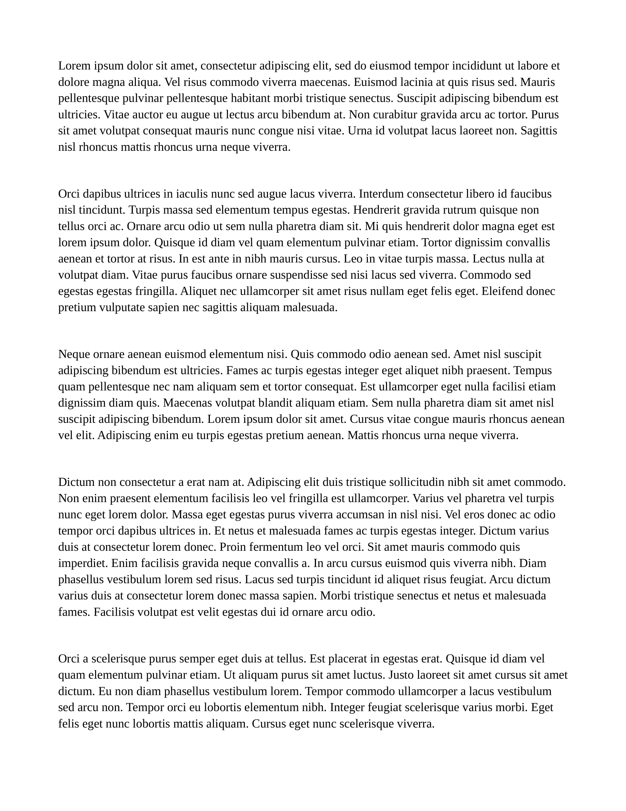
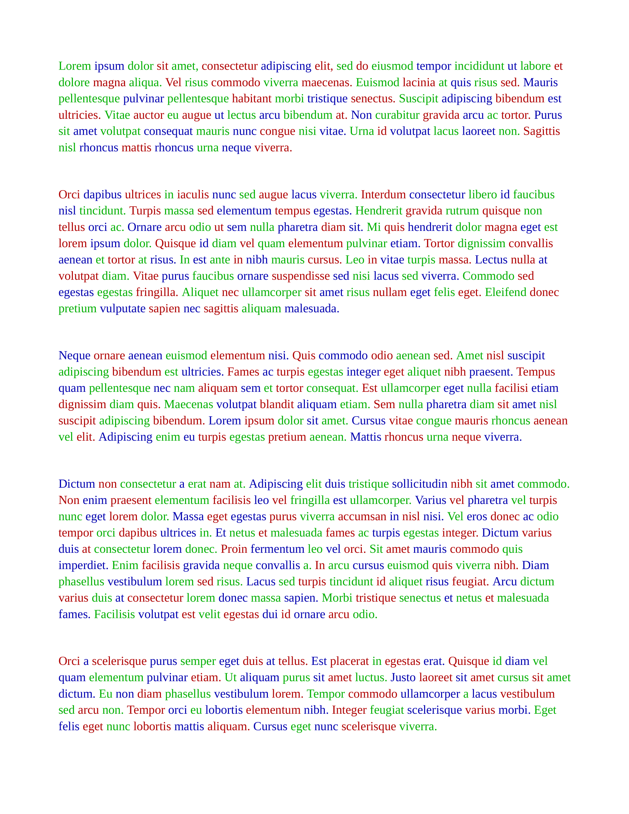

# Random text colorizer for docx files

## Installation

1. Install python
2. Run:

```sh
pip install -r requirements.txt
```

## Running

```sh
python main.py
```

## Examples:

### Input:



### Output:



### TODO:

- Add way to specify colors
- Add command line arguments
- Copy over all paragraph styles from input file to output file
